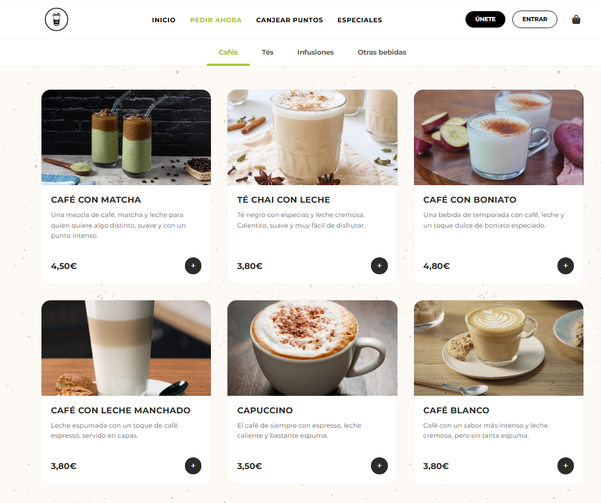
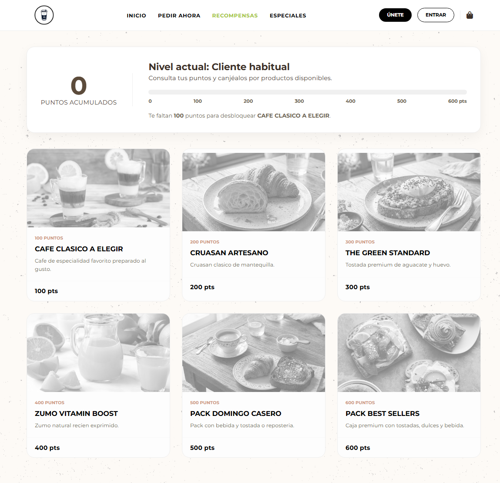
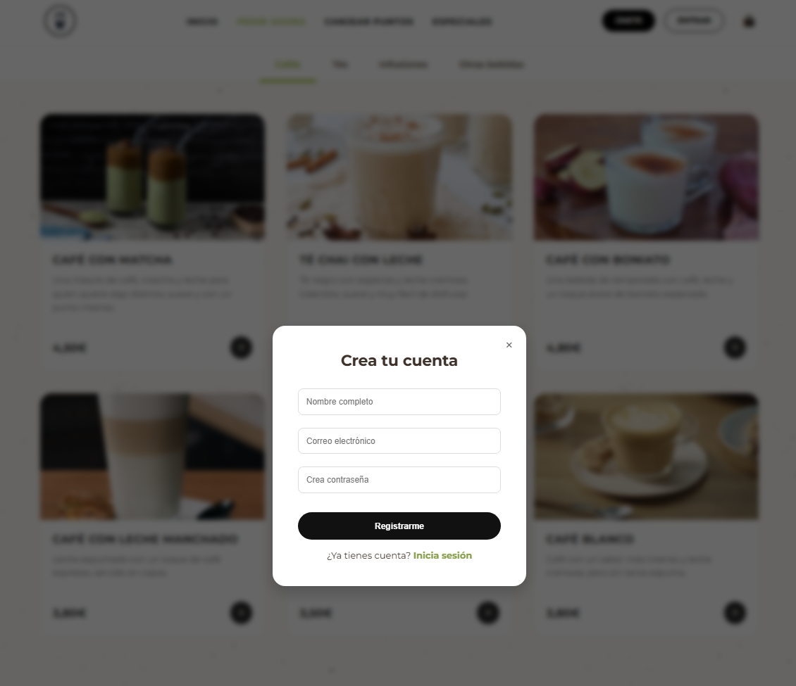

# Mundo Cafe

Aplicacion web full stack para una cafeteria con autenticacion de usuarios, catalogo de productos, carrito de compra, gestion de pedidos, perfil persistente y sistema de fidelizacion por puntos.

Este proyecto fue evolucionado desde una entrega academica a una version mas solida y presentable para portfolio, reforzando seguridad, persistencia, organizacion del codigo y experiencia de uso.

## Vista Rapida

- Aplicacion full stack con frontend en JavaScript vanilla y backend en Node.js
- Base de datos PostgreSQL con usuarios, pedidos, recompensas e historial
- Autenticacion con sesiones y contrasenas hasheadas
- Proyecto preparado para portfolio tecnico y publicacion en GitHub

## Tecnologias

`HTML` `CSS` `JavaScript` `Node.js` `Express` `PostgreSQL`

## Resumen

Mundo Cafe simula el flujo real de una cafeteria digital:

- registro e inicio de sesion
- consulta de carta y productos
- carrito de compra
- confirmacion de pedidos
- historial de pedidos
- perfil de usuario persistente
- recompensas por puntos y canje

El objetivo del proyecto es demostrar capacidad para construir una aplicacion web funcional conectada a base de datos, con logica de negocio real y un backend propio en Node.js.

## Que Demuestra Este Proyecto

- Desarrollo de backend propio con Express
- Integracion real entre interfaz, API y base de datos
- Gestion de autenticacion y sesiones
- Modelado de datos relacional con PostgreSQL
- Refactorizacion de un proyecto academico a una version orientada a portfolio

## Capturas Del Proyecto

### Catalogo y flujo principal de compra



### Sistema de recompensas por puntos



### Registro de usuarios



## Stack Tecnologico

- Frontend: HTML, CSS y JavaScript vanilla
- Backend: Node.js + Express
- Sesiones: `express-session`
- Base de datos: PostgreSQL
- Acceso a datos: `pg`
- Testing: `node:test`

## Funcionalidades Principales

- Autenticacion de usuarios con sesiones
- Registro de usuarios con contrasenas hasheadas
- Catalogo de productos y menus
- Carrito persistido en cliente
- Creacion de pedidos con lineas de pedido
- Sistema de puntos por compra
- Canje de recompensas conectado a base de datos
- Perfil editable con persistencia real
- Historial de pedidos por usuario
- Estados de pedido

## Mejoras Aplicadas Para Version Portfolio

- Sustitucion de contrasenas en texto plano por hashing con `scrypt`
- Configuracion por entorno con archivo `.env`
- Refuerzo del backend con validaciones reutilizables
- Persistencia real del perfil de usuario en PostgreSQL
- Checkout ampliado con tipo de entrega, destino, telefono, notas y metodo de pago
- Sincronizacion real entre recompensas frontend y backend
- Limpieza y simplificacion del esquema SQL
- README, `.env.example`, `.gitignore` y tests basicos para dejar el proyecto presentable

## Estructura Del Proyecto

```text
practicandoprogramasion/
├─ lib/
├─ public/
│  ├─ estilos/
│  ├─ funciones/
├─ sql/
├─ tests/
├─ server.js
├─ package.json
├─ .env.example
└─ README.md
```

## Arquitectura

### Backend

El backend centraliza:

- autenticacion
- validacion de datos
- gestion de sesion
- operaciones sobre usuarios
- operaciones sobre pedidos
- sistema de puntos y recompensas

Archivos clave:

- [server.js](C:\Users\Ferran\OneDrive\Escritorio\Proyecto página cafeteria\practicandoprogramasion\server.js)
- [lib/env.js](C:\Users\Ferran\OneDrive\Escritorio\Proyecto página cafeteria\practicandoprogramasion\lib\env.js)
- [lib/passwords.js](C:\Users\Ferran\OneDrive\Escritorio\Proyecto página cafeteria\practicandoprogramasion\lib\passwords.js)
- [lib/validators.js](C:\Users\Ferran\OneDrive\Escritorio\Proyecto página cafeteria\practicandoprogramasion\lib\validators.js)

### Frontend

El frontend esta hecho sin framework, apoyandose en HTML, CSS y JavaScript puro para mostrar la carta, gestionar el carrito, actualizar la sesion visible y conectar con la API.

Archivos clave:

- [public/index.html](C:\Users\Ferran\OneDrive\Escritorio\Proyecto página cafeteria\practicandoprogramasion\public\index.html)
- [public/funciones/auth.js](C:\Users\Ferran\OneDrive\Escritorio\Proyecto página cafeteria\practicandoprogramasion\public\funciones\auth.js)
- [public/funciones/carrito.js](C:\Users\Ferran\OneDrive\Escritorio\Proyecto página cafeteria\practicandoprogramasion\public\funciones\carrito.js)
- [public/funciones/TuPerfil.js](C:\Users\Ferran\OneDrive\Escritorio\Proyecto página cafeteria\practicandoprogramasion\public\funciones\TuPerfil.js)
- [public/funciones/CanjearPuntos.js](C:\Users\Ferran\OneDrive\Escritorio\Proyecto página cafeteria\practicandoprogramasion\public\funciones\CanjearPuntos.js)

### Base De Datos

La base de datos modela:

- usuarios
- productos
- categorias
- menus
- pedidos
- lineas de pedido
- recompensas
- historial de canjes

Scripts:

- [sql/schema_mundo_cafe.sql](C:\Users\Ferran\OneDrive\Escritorio\Proyecto página cafeteria\practicandoprogramasion\sql\schema_mundo_cafe.sql)
- [sql/seed_mundo_cafe.sql](C:\Users\Ferran\OneDrive\Escritorio\Proyecto página cafeteria\practicandoprogramasion\sql\seed_mundo_cafe.sql)

## Instalacion Y Puesta En Marcha

### 1. Requisitos

- Node.js 20 o superior
- PostgreSQL instalado y en ejecucion

### 2. Instalar dependencias

```bash
npm install
```

### 3. Configurar entorno

Crea un archivo `.env` a partir de:

- [.env.example](C:\Users\Ferran\OneDrive\Escritorio\Proyecto página cafeteria\practicandoprogramasion\.env.example)

Ejemplo de variables:

```env
PORT=3000
NODE_ENV=development
SESSION_SECRET=mundo-cafe-session-local
CORS_ORIGIN=http://localhost:3000

DB_HOST=localhost
DB_PORT=5432
DB_NAME=mundo_cafe_db
DB_USER=postgres
DB_PASSWORD=admin1234
```

### 4. Cargar base de datos

Ejecuta los scripts SQL en este orden:

```sql
\i sql/schema_mundo_cafe.sql
\i sql/seed_mundo_cafe.sql
```

### 5. Iniciar la aplicacion

```bash
node server.js
```

o en modo desarrollo:

```bash
npm run dev
```

### 6. Abrir en navegador

[http://localhost:3000](http://localhost:3000)

## Despliegue En Railway

1. Crea un servicio PostgreSQL en el mismo proyecto de Railway.
2. En el servicio `mundo-cafe`, configura estas variables:

```env
NODE_ENV=production
SESSION_SECRET=pon-una-clave-larga-y-privada
CORS_ORIGIN=https://tu-dominio-de-railway.up.railway.app
DATABASE_URL=${{Postgres.DATABASE_URL}}
```

Railway asigna `PORT` automaticamente, asi que no hace falta crearlo manualmente.

3. Pulsa `Apply changes` y despues `Deploy`.

En el primer arranque, si la base de datos esta vacia, la aplicacion crea las tablas y carga los datos demo desde `sql/schema_mundo_cafe.sql` y `sql/seed_mundo_cafe.sql`.

## Usuarios Demo

- Cliente principal: `ferran@mundocafe.com` / `DemoCafe2026`
- Cliente secundario: `laura@mundocafe.com` / `ClienteCafe2026`
- Administrador: `admin@mundocafe.com` / `AdminCafe2026`

## Testing

Ejecutar:

```bash
npm test
```

Actualmente incluye pruebas basicas de:

- hashing de contrasenas
- validacion de perfil
- validacion de pedidos
- validacion de email

Archivo:

- [tests/helpers.test.js](C:\Users\Ferran\OneDrive\Escritorio\Proyecto página cafeteria\practicandoprogramasion\tests\helpers.test.js)

## Valor Tecnico Del Proyecto

Este proyecto demuestra:

- construccion de una API propia con Express
- modelado relacional en PostgreSQL
- integracion frontend-backend sin framework
- autenticacion basada en sesiones
- gestion de estado entre cliente y servidor
- refactorizacion de una base academica a una estructura mas profesional

## Estado Del Proyecto

Version funcional local lista para demostracion y presentacion en portfolio.

## Posibles Mejoras Futuras

- panel de administracion para gestion de pedidos
- despliegue online con demo publica
- test de integracion contra base de datos temporal
- mejora visual final de la interfaz
- mayor modularizacion del backend por rutas y servicios

## Autor

Ferran Gimenez  
Proyecto orientado a portfolio de desarrollo web full stack.
